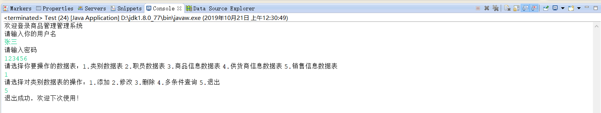
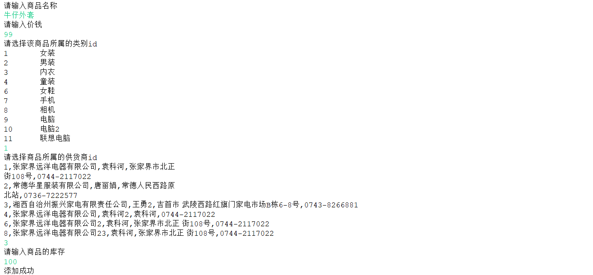

# JDBC综合案例-商品销售管理系统控制台版

**1.项目说明**：传统的商品管理一直依靠手工的方式，不能及时向经营者提供各类商品库存信息，从一定程度上影响了企业的经营活动，为此建立了一套动态反应商品信息的管理系统。该商品管理系统主要体现两点特性：(1).提高经营者管理水平，为企业提供有力的决策支持。(2)对商品信息进行科学化管理。

**2.开发环境**：eclipse+mysql

**3.数据库**：shopDB

1.  字符集：utf8
2.  排序规则：utf8_general_ci
3.  数据表 Employee(员工数据表) 供货商数据表(Offers) 商品类数据表(Category)

    商品数据表(Goods) 销售数据表(Sales)

4.  数据表详细信息和字段描述见下表

| 列名(中文名) | 列名(英文名) | 数据类型     | 长度 | 默认值 | 是否为空 | 描述         |
|--------------|--------------|--------------|------|--------|----------|--------------|
| 职员编号     | Employeeid   | int          |      |        | 非空     | 主键，自增列 |
| 姓名         | EmpName      | Varchar      | 15   |        | 非空     |              |
| 密码         | EmpPwd       | varchar      | 25   |        | 非空     |              |
| 性别         | Sex          | char         | 2    |        |          |              |
| 年龄         | Age          | int          |      |        |          |              |
| 聘用日期     | HireLong     | Datetime     |      |        |          |              |
| 月薪         | Salary       | DECIMAL(7,2) |      |        |          |              |

**Employee表**

| 列名(中文名) | 列名(英文名) | 数据类型 | 长度 | 默认值 | 是否为空 | 描述         |
|--------------|--------------|----------|------|--------|----------|--------------|
| 商家编号     | OfferID      | int      |      |        | 非空     | 主键，自增列 |
| 商家名称     | OfferName    | Varchar  | 100  |        | 非空     |              |
| 法人         | LegalIP      | Varchar  | 25   |        | 非空     |              |
| 地址         | Address      | Varchar  | 200  |        | 非空     |              |
| 联系电话     | Tel          | Varchar  | 50   |        |          |              |

**Offers表**

| 列名(中文名) | 列名(英文名) | 数据类型 | 长度 | 默认值 | 是否为空 | 描述         |
|--------------|--------------|----------|------|--------|----------|--------------|
| 类别编号     | CategoryId   | Int      |      |        | 非空     | 主键，自增列 |
| 类别名称     | CategoryName | Varchar  | 50   |        | 非空     |              |

**Category表**

| 列名(中文名) | 列名(英文名) | 数据类型        | 长度 | 默认值 | 是否为空 | 描述                 |
|--------------|--------------|-----------------|------|--------|----------|----------------------|
| 商品编号     | GoodId       | int             |      |        | 非空     | 主键，自增列         |
| 商品名称     | GoodName     | Varchar         | 100  |        | 非空     |                      |
| 单价         | Price        | Decimal（7，2） |      | 0      |          |                      |
| 类别编号     | CategoryId   | Int             |      |        | 非空     | 外键，类别表的外键   |
| 供货商编号   | OfferID      | int             |      |        | 非空     | 外键，供货商表的外键 |
| 库存         | Stockes      | int             |      |        |          |                      |

**Goods表**

| 列名(中文名) | 列名(英文名) | 数据类型 | 长度 | 默认值 | 是否为空 | 描述               |
|--------------|--------------|----------|------|--------|----------|--------------------|
| 销售编号     | SalesId      | int      |      |        | 非空     | 主键 自增列        |
| 当日销量     | SellAmount   | int      |      | 0      | 非空     |                    |
| 商品编号     | GoodId       | int      |      |        | 非空     | 外键,商品表的外键  |
| 职员编号     | EmployeeId   | int      |      |        | 非空     | 外键，职员表的外键 |
| 销售日期     | SellDate     | datetime |      |        | 非空     |                    |

**Sales表**

## 4.项目描述：

### 4.1登录系统

验证用户名和密码，验证成功后则进入操作选项界面。

验证失败则提示：用户名或密码输入错误，请重新输入。并让用户重新输入用户名和密码，再次进行验证。

### 4.2数据表操作

#### **4.2.1类别数据表**

如果用户选择了类别数据表，则展示类别数据表可以进行的操作

**4.2.1.1添加**

如果用户选择了添加，则先展示所有的类别信息，在控制台在进行提示：请输入类别名称，并判断类名名称是否已经存在，如果已经存在则提示用户：该类别信息已经存在，不能再次添加。如果添加成功，则提示：添加成功，反之则提示添加失败。

**4.2.1.2修改**

如果用户选择了修改，则先展示所有的类别信息，在控制台在进行提示：请 输入你要修改的类别ID，并判断该类别是否存在，如果已经存在则提示用 户：请修改类别名称；如果修改成功，则提示：修改成功，反之则提示修改 失败；如果 不存在则提示用户：抱歉，你要修改的类别信息不存在。

**4.2.1.3删除**

如果用户选择了删除，则先展示所有的类别信息，在控制台在进行提示：请 输入你要删除的类别ID，并判断该类别是否存在，如果已经存在则提示用 户：你确定删除吗？如果用户选择是，则判断该类别下是否含有商品信息， 如果含有商品信息,则提示用户：该类别下含有商品信息，不能删除；如果该 类别下不含有商品信息，则直接删除，并根据删除与否，给予相应的提示信 息。如果该类别不存在，则提示用户：抱歉，你要删除的类别信息不存在。

**4.2.1.4多条件查询**

如果用户选择了多条件查询，请输入你要查询的类别名称 可以模糊查询。如果 数据表中含有查询的信息，则进行展示；否职提示：抱歉，当前暂无你要的查询 信息。

**4.2.1.5退出**

如果用户选择了退出，则展示：退出成功，欢迎下次使用！并退出Java虚拟机。

#### **4.2.2供货商数据表**

如果用户选择了供货商数据表，则展示供货商数据表可以进行的操作

**4.2.2.1添加**

如果用户选择了添加，则先展示所有的供货商信息，在控制台在进行提示：依次要录入的供货商信息。并根据添加与否，给予相应的提示信息。供货商名称不能重复，如果供货商名称存在。则提示：抱歉，该供货商信息已经存在，请重新添加。

**4.2.2.2修改**

如果用户选择了修改，则先展示所有的供货商信息，在控制台在进行提示：请输入你要修改的供货商ID，并判断该供货商是否存在，如果已经存在则提示用户：依次要修改的数据信息；如果修改成功，则提示：修改成功，反之则提示修改失败；如果不存在则提示用户：抱歉，你要修改的供货商信息不存在。

**4.2.2.3删除**

如果用户选择了删除，则先展示所有的供货商信息，在控制台在进行提示：请输入你要删除的供货商ID，并判断该供货商是否存在，如果已经存在则提示用户：你确定删除吗？如果用户选择是，则判断该供货商下是否含有销售信息，如果含有销售信息,则提示用户：该供货商下含有商品信息，不能删除；如果该供货商下不含有商品信息，则直接删除，并根据删除与否，给予相应的提示信息。如果该供货商不存在，则提示用户：抱歉，你要删除的供货商信息不存在。

**4.2.2.4多条件查询**

如果用户选择了多条件查询，请提示多条件查询的范围：供货商名称、法人代表、公司地址、联系电话。如果数据表中含有查询的信息，则进行展示；否则提示：抱歉，当前暂无你要的查询信息。

**4.2.2.5退出**

如果用户选择了退出，则展示：退出成功，欢迎下次使用！并退出Java虚拟机

#### **4.2.3商品数据表**

如果用户选择了商品数据表，则展示商品数据表可以进行的操作

**4.2.3.1添加**

如果用户选择了添加，则先展示所有的商品信息，在控制台在进行提示：依次要 录入的商品信息。并根据添加与否，给予相应的提示信息。商品名称不能重复， 如果商品名称存在。则提示：抱歉，该商品信息已经存在，请重新添加；商品所 属的职员和供货商分别依次展示所有的职员信息和供货商信息，让用户选择所属 的职员ID和供货商ID。

**4.2.3.2修改**

如果用户选择了修改，则先展示所有的商品信息，在控制台在进行提示：请输入 你要修改的商品ID，并判断该商品是否存在，如果已经存在则提示用户：依次要 修改的数据信息；如果修改成功，则提示：修改成功，反之则提示修改失败；如 果不存在则提示用户：抱歉，你要修改的商品信息不存在。

**4.2.3.3删除**

如果用户选择了删除，则先展示所有的商品信息，在控制台在进行提示：请输入 你要删除的商品ID，并判断该商品是否存在，如果已经存在则提示用户：你确定 删除吗？如果用户选择是，则判断该职员下是否含有销售信息，如果含有销售信 息,则提示用户：该商品下含有销售信息，不能删除；如果该职员下不含有销售信 息，则直接删除，并根据删除与否，给予相应的提示信息。如果该商品不存在， 则提示用户：抱歉，你要删除的商品信息不存在。

**4.2.3.4多条件查询**

如果用户选择了多条件查询，请提示多条件查询可以根据：商品名称、价钱区 间、所属职员、所属供货商、库存区间进行查询。如果数据表中含有查询的信 息，则进行展示；否则提示：抱歉，当前暂无你要的查询信息。

**4.2.3.5退出**

如果用户选择了退出，则展示：退出成功，欢迎下次使用！并退出Java虚拟机

#### **4.2.4销售数据表**

**4.2.4.1添加**

如果用户选择了添加，则先展示所有的销售信息，在控制台在进行提示：依次要 录入的销售信息。并根据添加与否，给予相应的提示信息。

**4.2.4.2修改**

如果用户选择了修改，则先展示所有的销售信息，在控制台在进行提示：请输入 你要修改的销售ID，并判断该销售是否存在，如果已经存在则提示用户：依次要 修改的数据信息；如果修改成功，则提示：修改成功，反之则提示修改失败；如 果不存在则提示用户：抱歉，你要修改的销售信息不存在。

**4.2.4.3删除**

如果用户选择了删除，则先展示所有的销售信息，在控制台在进行提示：请输入 你要删除的销售ID，并判断该销售是否存在，如果已经存在则提示用户：你确定 删除吗？如果用户选择是，则进行删除，并根据删除与否，给予相应的提示信 息。如果该销售不存在，则提示用户：抱歉，你要删除的销售信息不存在。

**4.2.3.4多条件查询**

如果用户选择了多条件查询，则提示多条件查询可以根据：数量区间、商品名 称、职员姓名、销售日期区间 进行多条件查询。如果数据表中含有查询的信息， 则进行展示；否则提示：抱歉，当前暂无你要的查询信息。

**4.2.3.5退出**

如果用户选择了退出，则展示：退出成功，欢迎下次使用！并退出Java虚拟机

#### **4.2.5职员数据表**

如果用户选择了职员数据表，则展示职员数据表可以进行的操作

**4.2.5.1添加**

如果用户选择了添加，则先展示所有的职员信息，在控制台在进行提示：依次要 添加的数据信息。其中密码的长度必须大于6位，输入的两次密码必须相等；性 别只能是男或女；年龄和薪水必须大于0，并根据添加与否，给予相应的提示信 息。

**4.2.5.2修改**

如果用户选择了修改，则先展示所有的职员信息，在控制台在进行提示：请输入 你要修改的职员ID，并判断该职员是否存在，如果已经存在则提示用户：依次要 修改的数据信息；如果修改成功，则提示：修改成功，反之则提示修改失败；如 果不存在则提示用户：抱歉，你要修改的职员信息不存在。

**4.2.5.3删除**

如果用户选择了删除，则先展示所有的职员信息，在控制台在进行提示：请输入 你要删除的职员ID，并判断该职员是否存在，如果已经存在则提示用户：你确定 删除吗？如果用户选择是，则判断该职员下是否含有销售信息，如果含有销售信 息,则提示用户：该职员下含有销售信息，不能删除；如果该职员下不含有销售信 息，则直接删除，并根据删除与否，给予相应的提示信息。如果该职员不存在， 则提示用户：抱歉，你要删除的职员信息不存在。

**4.2.5.4多条件查询**

如果用户选择了多条件查询，提示：员工表可以进行多条件查询的字段有：员工姓 名、性别、年龄区间、入职日期区间、薪酬区间。其中员工姓名为模糊查询。如果 数据表中含有查询的信息，则进行展示；否职提示：抱歉，当前暂无你要的查询 信息。

**4.2.5.5退出**

如果用户选择了退出，则展示：退出成功，欢迎下次使用！并退出Java虚拟机。

